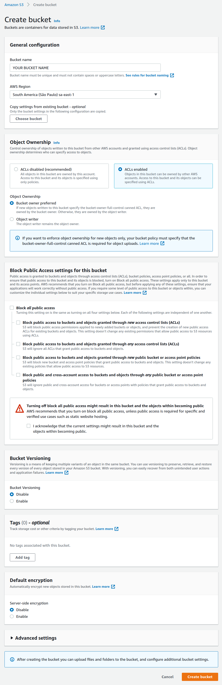

# Serverless - AWS Node.js Typescript

This project has been generated using the `aws-nodejs-typescript` template from the [Serverless framework](https://www.serverless.com/).

Generate a certificate and verify if the certificate is valid.

<br />

## Setting up the environment

### Install serverless framework

Install the serverless framework globally on your system

```bash
npm install -g serverless
```

### Configure credentials via CLI

But first it is necessary to create a user on AWS by the IAM service, and use `AdministratorAccess` as permission for it, then yes you will get the `key` and `secret` to configure in the CLI

```bash
serverless config credentials --provider aws --key=YOUR_KEY --secret YOUR_SECRET -o
```

> **-o** flag to replace existing configuration

### Configure AWS region

Show current aws config

```bash
cat ~/.aws/config
```

Define your region

```text
[default]
region=sa-east-1
```

> Change **sa-east-1** to your preferred region, the region you put in that file, must be configured in the **serverless.ts** file on **line 18**

### Configure AWS S3 Bucket

But first it is necessary to create a bucket on AWS by the S3 service, you need to activate the ACL and make your Bucket public to be able to view the PDF generated later, but rest assured, we will only give permission to read this file through the ACLs

See the necessary settings to do on AWS S3



### Configure .env

Set your environment variables

```bash
cp .env.example .env
```

Configure the bucket name and bucket region with the information you have set up on AWS S3

```text
AWS_S3_BUCKET_NAME=
AWS_S3_REGION=
```

### Observation

I recommend setting a single region for everything, in my case I preferred the **sa-east-1** region so it doesn't cause confusion

<br />

## Installation instructions

Depending on your preferred package manager, follow the instructions below to deploy your project.

> **Requirements**: NodeJS >= 14.15.0

### Using NPM

- Run `npm i` to install the project dependencies

### Using Yarn

- Run `yarn` to install the project dependencies

<br />

## Run in development mode

### Using NPM

```bash
npm run dynamo:install
npm run dynamo:start
npm run dev
```

### Using Yarn

```bash
yarn dynamo:install
yarn dynamo:start
yarn dev
```

<br />

## Testing endpoints

### generateCertificate endpoint

> **POST** http://localhost:3000/dev/generateCertificate

Body

You can generate uuid with this site: https://www.uuidgenerator.net

```json
{
	"id": "6d626080-cee3-4031-90f5-c1a6e9421d26",
	"name": "Your name",
	"grade": "10"
}
```

### verifyCertificate endpoint

> **GET** http://localhost:3000/dev/verifyCertificate/YOUR_ID

Change `YOUR_ID` to the `id` entered in the run above to generate the certificate

<br />

## Deploy

### Using NPM

- Run `npm run deploy` to deploy this stack to AWS

### Using Yarn

- Run `yarn deploy` to deploy this stack to AWS

<br />

## Remove stack on AWS

### Using NPM

- Run `npm run rm` to remove this stack on AWS

### Using Yarn

- Run `yarn rm` to remove this stack on AWS

<br />

## Project structure

The project code base is mainly located within the `src` folder. This folder is divided in:

- `functions` - containing code base and configuration for your lambda functions
- `libs` - containing shared code base between your lambdas

```
├── src
│   ├── functions               # Lambda configuration and source code folder
│   │   ├── generateCertificate
│   │   │   ├── handler.ts      # `generateCertificate` lambda source code
│   │   │   └── index.ts        # `generateCertificate` lambda Serverless configuration
│   │   ├── verifyCertificate
│   │   │   ├── handler.ts      # `verifyCertificate` lambda source code
│   │   │   └── index.ts        # `verifyCertificate` lambda Serverless configuration
│   │   │
│   │   └── index.ts            # Import/export of all lambda configurations
│   │
│   └── libs                    # Lambda shared code
│       └── handlerResolver.ts  # Sharable library for resolving lambda handlers
│
├── package.json                # Dependencies and scripts config
├── serverless.ts               # Serverless service file
├── tsconfig.json               # Typescript compiler configuration
└── tsconfig.paths.json         # Typescript paths
```
